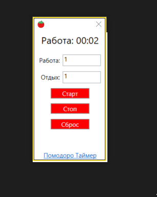

WPF Pomodoro Timer 
==========================================================
Это простой таймер Помодоро для Windows. Это WPF-приложение, написанное на C#.

Тэги: WPF, C#, Pomodoro, Timer, XAML, .NET, .NET Core, .NET 8
